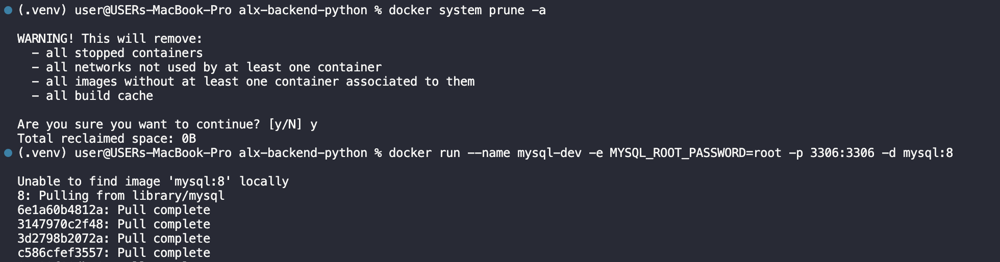
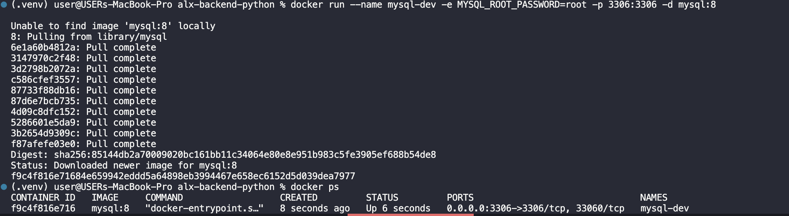
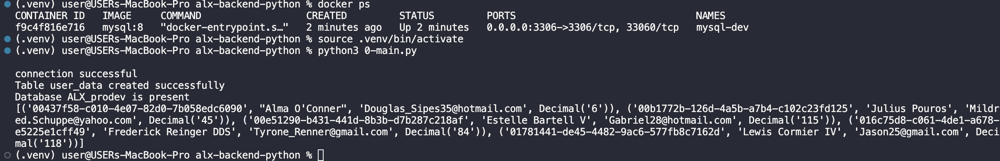
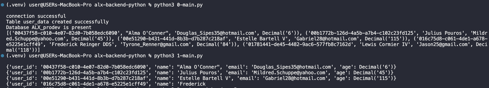
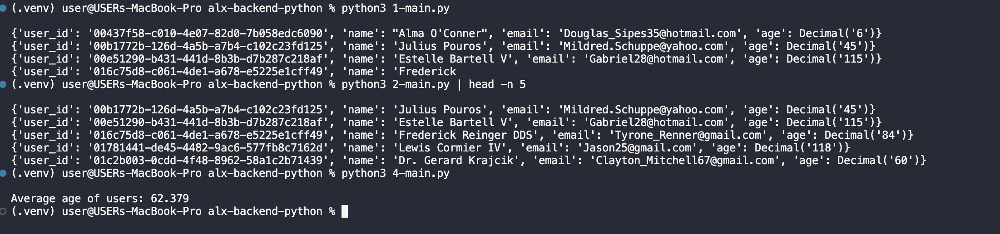

# ALX Python Generators Project

# Generators Project

This repository contains a practical demonstration of Python generators for scalable and memory-efficient data processing. It integrates Python with MySQL to simulate real-world data streaming scenarios including row streaming, batch processing, lazy pagination, and on-the-fly aggregation.

---

## Project Objectives

- Leverage Python generator functions and `yield` for streaming data.
- Stream SQL query results without loading full datasets into memory.
- Apply batch processing for grouped user data.
- Simulate pagination using offset-limit logic with generators.
- Compute average values efficiently using streamed input.
- Integrate MySQL with Python using `mysql-connector-python`.

---

## Repository Structure

```
python-generators-0x00/
│
├── seed.py                    # Creates database and seeds data from CSV
├── user_data.csv              # Raw user data used for DB population
│
├── 0-main.py                  # Initializes database and prints sample data
├── 0-stream_users.py          # Streams user data one-by-one using generator
│
├── 1-main.py
├── 1-batch_processing.py      # Streams users in batches and filters by age
│
├── 2-main.py
├── 2-lazy_paginate.py         # Implements lazy pagination using offset
│
├── 3-main.py
│
├── 4-main.py
├── 4-stream_ages.py           # Streams ages and computes average lazily
│
├── .env                       # Environment variables for DB access
└── README.md                  # Project overview and task documentation
```

---

## Tasks Breakdown

| Task    | File(s)                        | Description                                                                 |
|---------|-------------------------------|-----------------------------------------------------------------------------|
| Task 0  | `seed.py`, `0-main.py`         | Create `ALX_prodev` MySQL database and `user_data` table. Populate with `user_data.csv` |
| Task 1  | `0-stream_users.py`            | Use generator function to stream user rows one at a time                    |
| Task 2  | `1-batch_processing.py`        | Implement batch streaming and filter users over age 25                      |
| Task 3  | `2-lazy_paginate.py`           | Paginate rows using `offset` and `limit` with a generator                   |
| Task 4  | `4-stream_ages.py`             | Stream ages and compute average without loading all rows                   |

---

## Getting Started

### 1. Clone the Repository
```bash
git clone https://github.com/Stormz99/python-generators-0x00.git
cd python-generators-0x00
```

### 2. Set Up Python Environment
```bash
python3 -m venv .venv
source .venv/bin/activate
pip install mysql-connector-python python-dotenv
```

### 3. Configure MySQL with Docker
```bash
docker run --name mysql-dev -e MYSQL_ROOT_PASSWORD=root -p 3306:3306 -d mysql:8
```





### 4. Set Up Environment Variables
Create a `.env` file in the root directory:
```env
DB_HOST=localhost
DB_USER=root
DB_PASSWORD='your password'
DB_NAME=ALX_prodev
```

### 5. Seed the Database
```bash
python3 0-main.py
```
This creates the database and populates it from the CSV file.




---

## How to Run Each Task

### Task 1 – Stream Users
```bash
python3 1-main.py
```

### Task 2 – Batch Processing
```bash
python3 2-main.py | head -n 5
```

### Task 3 – Lazy Pagination
```bash
python3 3-main.py | head -n 7
```


### Task 4 – Stream and Average Age
```bash
python3 4-main.py
```

---

## Adding Screenshots

I added screenshots to the project which can be found in the `images/` directory:






---

## Notes

- This project simulates streaming of database data using Python’s `yield` keyword
- Focuses on performance optimization, lazy loading, and generator patterns
- Developed as part of the **ALX Backend Specialization (ProDev Track)**

---

## Author

**Ijiola Abiodun**  
[GitHub](https://github.com/Stormz99) · Cloud & Backend Developer · AWS | GCP | DevOps

---

## License

This project is licensed by ALX Africa © 2025. All rights reserved.
